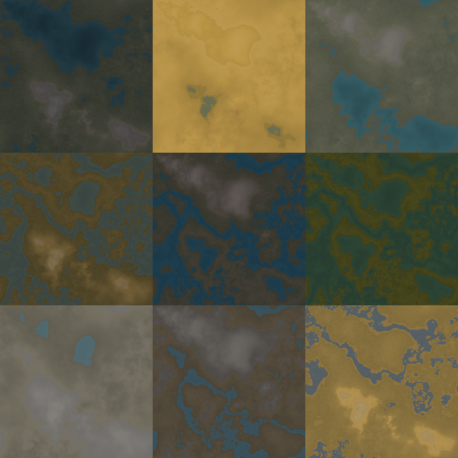

# spacedust-terrain-generator

terrain generation experiments for [spacedust](http://www.spacedust.info)

**installation**

1. git clone git@github.com:mjwhitt/fractal_noise.git
2. git clone git@github.com:mjwhitt/spacedust-terrain-generator.git
3. cd spacedust-terrain-generator/
4. bundle install --path vendor/

**examples**

